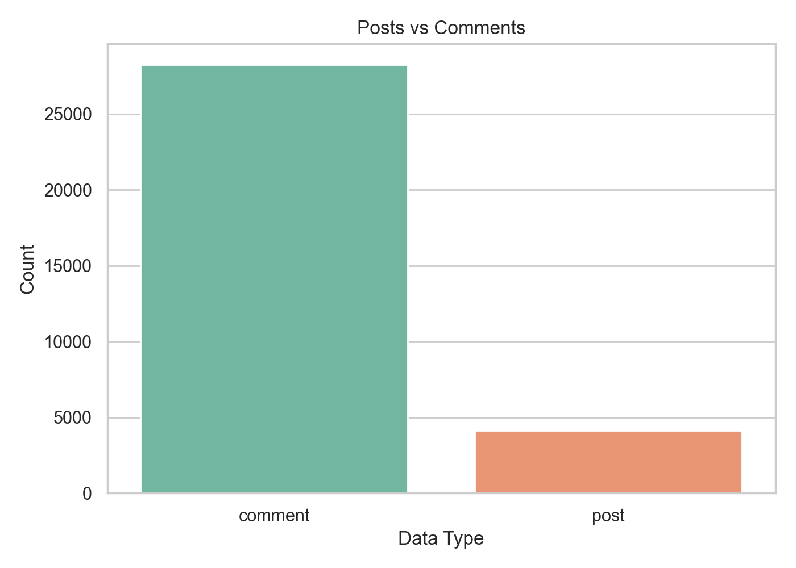
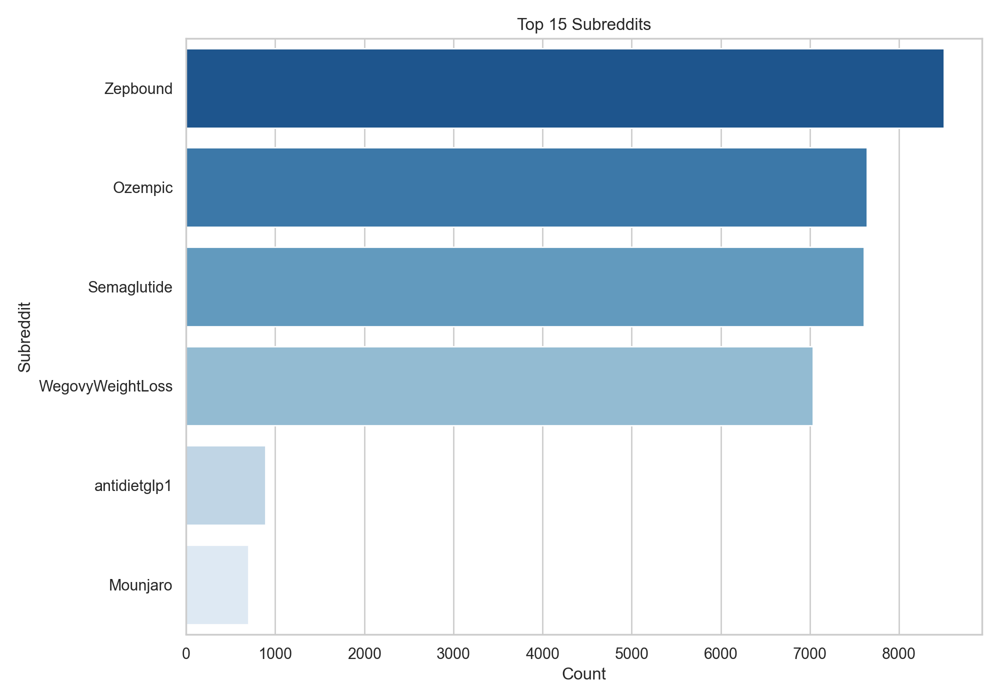
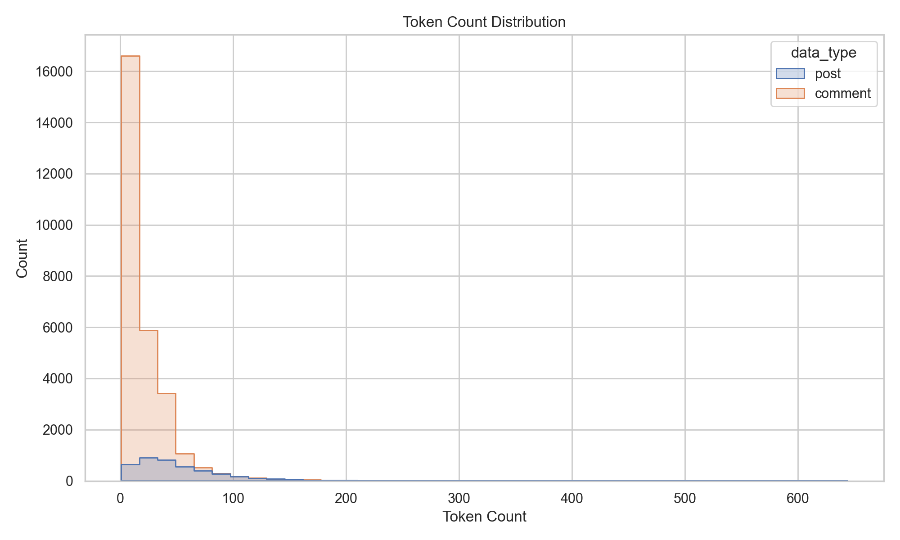

# GLP-1 Reddit NLP Pipeline

Curated public portfolio version of a BIS 550 final project on GLP-1 discourse across Reddit communities.

This repository demonstrates the NLP/data-engineering workflow behind the project without publishing raw Reddit posts, comments, labels, processed datasets, or model-prediction files.

## Overview

GLP-1 medications have moved from clinical diabetes care into mainstream conversations about weight loss, body image, side effects, and diet culture. Reddit became a useful lens into those conversations because users describe experiences in their own words across medication-specific and anti-diet communities.

The original group project built a pipeline to collect, clean, explore, label, and classify public Reddit discourse around GLP-1 medications. The analysis separated posts and comments into frames such as medical support, neutral discussion, and toxic diet culture.

## My Contribution

My work focused on the data and NLP foundation:

- data collection design,
- NLP preprocessing implementation,
- exploratory data analysis,
- methods/write-up for preprocessing and EDA,
- slide/presentation material for the data pipeline section.

## Technical Approach

The public-safe version keeps the reusable engineering ideas:

1. **Ingestion contract:** normalize Apify/Reddit-style post and comment records.
2. **Text cleaning:** strip HTML, Markdown, URLs, deleted/removed markers, mojibake, and unstable whitespace.
3. **Tokenization:** normalize domain terms such as `GLP-1`, remove stopwords, and produce countable tokens.
4. **EDA:** summarize post/comment mix, subreddit distribution, time trends, text length, and common terms.
5. **Modeling handoff:** produce clean, analysis-ready text fields for manual labeling, topic modeling, and supervised classification.

## Aggregate Results

The cleaned corpus used in the final project contained:

| Metric | Value |
|---|---:|
| Total rows | 32,377 |
| Posts | 4,136 |
| Comments | 28,241 |
| Unique subreddits | 6 |
| Average token count | 26.06 |
| Median token count | 16.0 |

Manual annotation was conducted in two stages: 700 randomly sampled items for broad discourse coverage, plus 300 targeted items to improve coverage of the minority toxic-diet-culture class. The final labeled set contained 1,000 items. The public repo does not include those rows or labels.

## Example Aggregate Figures







## Repository Structure

```text
src/glp1_nlp/
  text_cleaning.py   # public-safe cleaning/tokenization helpers
  records.py         # normalize post/comment records
  eda.py             # aggregate EDA summaries from in-memory records
tests/
  test_glp1_nlp.py   # synthetic no-data tests
docs/
  methods.md
  results_summary.md
  privacy.md
  contribution_note.md
assets/figures/
  aggregate plots only
data/
  README.md          # explains why no datasets are published
```

## Run the Public Checks

The tests use synthetic records only.

```bash
python -m unittest discover -s tests
```

## Data and Privacy

No raw Reddit exports, cleaned datasets, labeled examples, model predictions, post/comment text, usernames, URLs, or row-level data are published here. The repository is a display-first portfolio artifact with reusable code patterns, documentation, and aggregate-only figures.

## Skills Demonstrated

- Python data pipeline design
- NLP preprocessing
- Public-health text analytics
- EDA and aggregate visualization
- Privacy-conscious data publication
- Manual-labeling workflow design
- Recruiter-readable technical documentation
